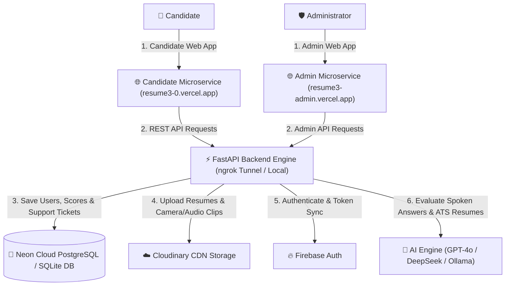

# 🚀 CloudOps AI Assessment OS — Comprehensive Project Documentation & Architecture 🏗️📊

## 📌 Executive Summary & Project Purpose

The **CloudOps AI Assessment OS** is a state-of-the-art, production-grade AI interview and skill evaluation Operating System tailored specifically for **Cloud Operations, DevOps, DevSecOps, Site Reliability Engineering (SRE), and Infrastructure Engineers**.

Designed with a dual-microservice frontend deployment architecture, the platform bridges the gap between candidate preparation and enterprise hiring by providing:
1. **Real-time Voice AI Technical Interviews** with 5-pillar objective scoring rubrics & WebRTC audio/video capture.
2. **Automated 6-Factor Resume ATS Screening** with STAR-formula bullet-point metric rewrites.
3. **80% Stage-Gated Progression System** across 5 Core Challenge Stages (Candidates must score $\ge 80\%$ to unlock successive interview rounds up to the Production Incident Final Boss).
4. **Dedicated Administrator Suite** with real-time candidate assessment analytics, JD-to-Template blueprint generation, 90-Day Retention Purge trigger, and Support Ticket Inbox Manager.

---

## 🌐 Live Production Deployments & Microservices

| Portal / Service | Production Live URL | System Description |
| :--- | :--- | :--- |
| **🎓 Candidate Portal** | [https://resume3-0.vercel.app](https://resume3-0.vercel.app) | Candidate Dashboard, 5-Stage Voice Interview UI, ATS Resume Analyzer, Career Roadmap, Leaderboard, Certificates, Help Support |
| **🛡️ Dedicated Admin Suite** | [https://resume3-admin.vercel.app](https://resume3-admin.vercel.app) | Administrator Microservice, Candidate Assessment Analytics, AI Model Prompt Control, 90-Day Retention Purge, Support Tickets Real-Time Inbox |
| **⚡ FastAPI Backend Engine** | [https://handcuff-dweller-crimp.ngrok-free.dev/api/v1](https://handcuff-dweller-crimp.ngrok-free.dev/api/v1) | FastAPI Async Microservice Gateway with CORS `allow_origin_regex` for Vercel microservices, SQLAlchemy 2.0 Async ORM |
| **📚 Interactive Swagger Docs** | [https://handcuff-dweller-crimp.ngrok-free.dev/docs](https://handcuff-dweller-crimp.ngrok-free.dev/docs) | Open API Documentation & Endpoint Tester |

---

## 🛠️ Complete Tech Stack & Infrastructure



### 1. Backend Microservices (FastAPI & Python 3.14)
* **Framework:** Python 3.14 + FastAPI (Async RESTful microservices architecture).
* **ORM & DB Client:** SQLAlchemy 2.0 (Async) + `asyncpg` driver for Neon PostgreSQL / SQLite.
* **CORS Security:** Configured with `allow_origin_regex=r"https://.*\.vercel\.app"` allowing cross-origin requests across all Vercel microservices.
* **Data Validation:** Pydantic v2 schemas + `pydantic-settings`.
* **Auth & Security:** OAuth2 Bearer JWT Tokens, `passlib` Bcrypt password hashing, and Firebase Admin ID Token verification.

### 2. Multi-Cloud Storage Architecture (3-Tier Infrastructure)
* **🔥 Firebase Auth:** Manages all user account registrations, logins, Google OAuth, and ID tokens.
* **☁️ Cloudinary CDN Storage:** Stores candidate PDF/DOCX resumes, profile pictures, WebRTC camera snapshots, and video/audio interview recordings (`.webm`/`.wav`). Auto-cleaned after 90 days via `RetentionService`.
* **🐘 Neon Cloud PostgreSQL Database:** Primary serverless PostgreSQL instance storing relational schemas (`users`, `candidates`, `interview_attempts`, `stage_attempts`, `question_attempts`, `resume_audits`, `support_tickets`).

### 3. Artificial Intelligence & Speech Processing
* **AI Provider Engine:** **OpenAI GPT-4o / DeepSeek R1** for 5-pillar spoken answer evaluation, STAR bullet rewriting, 30-day personalized roadmap generation, and JD-to-Template blueprint creation.
* **Speech-to-Text (STT):** **Whisper Engine** (Transcribes candidate spoken audio into text with Words Per Minute [WPM] cadence analysis).

---

## 🔑 Active Platform Accounts & Credentials

The system operates with **2 clean, verified active accounts** (Extra sample candidate data purged):

| Role | Name | Email | Password | Microservice Portal Access |
|---|---|---|---|---|
| **🛡️ Administrator** | Alex Vance (Admin) | `admin@cloudops.internal` | `Admin@12345` | Dedicated Admin Portal (`resume3-admin.vercel.app`) |
| **🎓 Candidate** | Sachin Rawat | `sachin@cloudops.internal` | `Sachin@12345` | Candidate Portal (`resume3-0.vercel.app`) |

---

## 🎯 Key Platform Workflows & Features

### 1. 5-Stage Gated Interview Progression System
Candidates clear each stage with an **80% minimum score threshold** to advance:
- **Stage 1: Profile & Career Pitch** (90-second intro, past achievements).
- **Stage 2: Linux Systems Warrior** (Kernel sockets, systemd, process triage, disk I/O wait).
- **Stage 3: Multi-Cloud Architecture** (AWS VPC subnets, NAT Gateways, IAM STS, IRSA).
- **Stage 4: DevOps & Containers** (Multi-stage Docker builds, Kubernetes EKS manifests, Canary releases).
- **Stage 5: Production Incident Boss Battle** (CrashLoopBackOff triage, 502/504 outage response).

### 2. 5-Pillar Voice Evaluation Rubric
Every spoken answer is scored across:
- **Technical Accuracy (40%)**: Correctness of technical concepts and commands.
- **Concept Coverage (25%)**: System internals and edge cases.
- **Reasoning Quality (20%)**: Logical troubleshooting methodology.
- **Practical Knowledge (10%)**: Real-world hands-on command mastery.
- **Communication Clarity (5%)**: Structuring of explanation and cadence.

### 3. 🎫 Real-Time Support Tickets Inbox (Candidate ➔ Admin)
- **Candidate Submission**: Candidates submit technical queries on Candidate Portal (`/help`).
- **Database Storage**: Saved to DB `support_tickets` table with code `TCK-XXXX`.
- **Admin Real-Time Inbox (`resume3-admin.vercel.app/help`)**: Features 4 KPI Metric Cards (Total, Open, In Progress, Resolved), Filter Pills, Search Bar, Candidate Data Table, and interactive Ticket Status Manager (`OPEN`, `IN_PROGRESS`, `RESOLVED`, `CLOSED`).

### 4. 🧹 90-Day Audio & Video Retention Purge
- Background `RetentionService` identifies audio/video recordings older than 90 days and purges them from Cloudinary CDN storage while retaining audit logs.

---

## 📁 Repository Directory Structure

```
d:\AI_Interview3.0\
├── backend/
│   ├── app/
│   │   ├── api/v1/         # REST API Endpoints (Auth, Candidates, Admin, Resumes, Support)
│   │   ├── core/           # Config, Database Engine, Security, CORS
│   │   ├── models/         # SQLAlchemy DB Models (User, Candidate, Stage, SupportTicket)
│   │   ├── schemas/        # Pydantic Request/Response Schemas (Support, User, Attempt)
│   │   ├── services/       # Business Logic (Auth, ATS, Admin, Retention, Email)
│   │   ├── speech/         # Whisper Speech-to-Text STT Integration
│   │   ├── storage/        # Cloudinary Storage Provider
│   │   ├── seeds/          # Initial Data Seeding (Admin, Sachin Rawat, 5 Stages)
│   │   └── main.py         # FastAPI Gateway Entry Point
│   ├── cloudops_interview.db # SQLite Local Database File
│   ├── requirements.txt
│   └── Dockerfile
├── frontend/
│   ├── app/                # Next.js App Router (Auth, Candidate Dashboard, Admin Suite, Help)
│   ├── components/         # UI Components (Sidebar, Navbar, ThemeToggle, BrandLogos)
│   ├── lib/                # API Client, Zustand Auth Store, Local Storage
│   └── globals.css         # SovoHR Royal Blue Design System
├── PROJECT_OVERVIEW.md     # Full System Architecture & Overview
└── README.md               # GitHub Public Documentation
```

---

## ⚡ How to Run Locally

### 1. Start FastAPI Backend (Port 8000)
```powershell
cd d:\AI_Interview3.0\backend
.\venv\Scripts\uvicorn app.main:app --reload --port 8000
```

### 2. Start Next.js Frontend (Port 3001)
```powershell
cd d:\AI_Interview3.0\frontend
npx next dev -p 3001
```
Open [http://localhost:3001](http://localhost:3001) in your browser. 🚀
