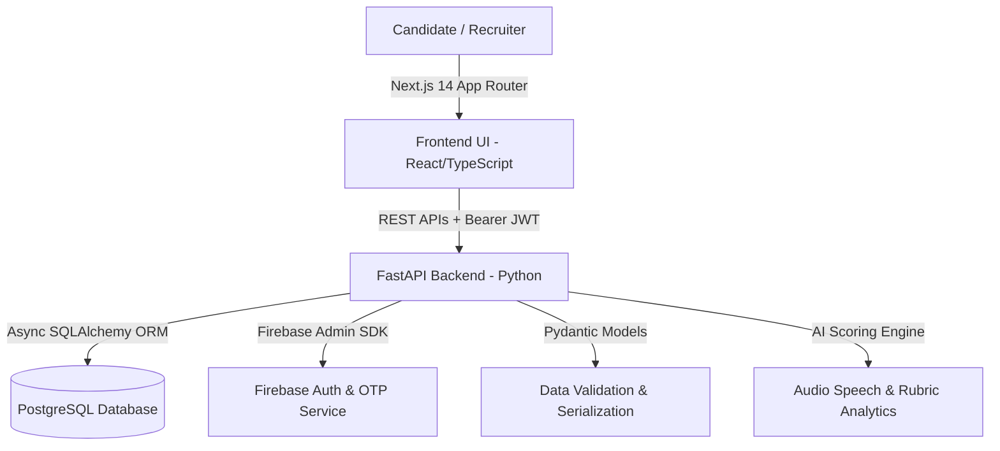

# 🚀 CloudOps AI 3.0 — Complete Project Overview & Technical Architecture

> **AI-Powered Voice Interview & Career Operating System for DevOps & Cloud Engineers**  
> *Production-Ready • Database-Driven • Real-time AI Audio Telemetry & ATS Analytics*

---

## 📌 Executive Summary

**CloudOps AI 3.0** is an enterprise-grade, end-to-end AI platform designed to evaluate, train, and accelerate Cloud and DevOps Engineers for real-world production roles. 

Unlike generic multiple-choice quiz apps, CloudOps AI simulates **real technical voice interviews**, **live production outage troubleshooting**, and **ATS resume optimizations** backed by real-time PostgreSQL data persistence and 5-pillar rubric scoring.

---

## 🏗️ Technical Architecture & Tech Stack



### 1. **Frontend Architecture**
- **Framework**: Next.js 14 (App Router with `use client` hydration isolation)
- **Language**: TypeScript (`.tsx` / `.ts`)
- **Styling**: Tailwind CSS with custom HSL color tokens, dark mode/glassmorphism, and responsive grid layouts (`sm`, `md`, `lg`, `xl`)
- **State Management**: Zustand (`useAuthStore`) with local storage persistence
- **Icons & Visuals**: Lucide React, custom 3D WebP cloud illustrations, KaTeX math rendering
- **API Fetcher**: Centralized `apiFetch` wrapper with JWT Bearer header injection

### 2. **Backend Architecture**
- **Framework**: FastAPI (Python 3.10+)
- **ORM & Database**: Async SQLAlchemy 2.0 with PostgreSQL database driver (`asyncpg`)
- **Validation**: Pydantic v2 schemas for strict request/response type checking
- **Authentication**: JWT (`pyjwt`) with Bearer token headers, bcrypt password hashing, and Firebase Admin SDK for phone OTP
- **Server**: Uvicorn ASGI running on port `8000`

---

## 🌟 Key Features & The 7 Core Services

```
                       ┌─────────────────────────────────────────┐
                       │       CloudOps AI Command Center        │
                       └───────────────────┬─────────────────────┘
                                           │
       ┌───────────────┬───────────────────┼───────────────────┬───────────────┐
       ▼               ▼                   ▼                   ▼               ▼
1. Interview      2. Resume ATS       3. Progress &       4. Global       5. Career
   Stages            Audit               Matrix            Leaderboard        Roadmap
 (5 AI Stages)    (JD Matcher)       (5-Pillar Rubric)    (XP Rankings)    (30-Day Plan)
                                           │
                                   ┌───────┴───────┐
                                   ▼               ▼
                              6. Settings     7. Support
                             (Profile/Band)  (24/7 AI Help)
```

### 🎯 1. 5-Stage Voice Interview Pipeline
An interactive, stage-by-stage voice interview simulator with live scores, unlocked progression, and instant re-attempt capabilities:
- **Stage 1: Profile & Career Pitch** (*Soft Skills, STAR Method, Experience Pitch*)
- **Stage 2: Linux Systems Warrior** (*Kernel/OS, SystemD, Memory & Shell Scripting*)
- **Stage 3: Multi-Cloud Architecture** (*AWS VPC, IAM, IRSA, Subnets, Terraform IaC*)
- **Stage 4: DevOps & Containers** (*Docker, Kubernetes EKS, Helm, CI/CD Pipelines*)
- **Stage 5: Production Incident Boss Battle** (*Outage Triage, RCA, Log Analysis, SRE*)

### 📄 2. AI Resume ATS Audit Studio
- Parses uploaded resumes against target DevOps/Cloud Job Descriptions.
- Computes overall **ATS Score Ring**, matching skill counts, and keyword alignment percentage.
- Features an AI-powered **STAR Bullet Rewriter** to upgrade bullet points for recruiter impact.

### 📊 3. My Progress & 5-Pillar Rubric Matrix
Provides a multi-dimensional rubric radar across 5 core evaluation pillars:
1. **Technical Accuracy (40%)**
2. **Concept Coverage (25%)**
3. **Reasoning Quality (20%)**
4. **Practical Knowledge (10%)**
5. **Communication Clarity (5%)**
- Includes speech telemetry (Words-per-minute pacing, filler word frequency, confidence signals).

### 🏆 4. Global Leaderboard & XP Gamification
- Tracks candidate attempt XP, active day streaks, level badges, and global rank placement.

### 🗺️ 5. AI Career Roadmap (30 Days)
- A structured 4-week learning & troubleshooting checklist tailored for senior Cloud Ops roles.

### ⚙️ 6. Account & Role Settings
- Candidate target role configuration (e.g. *Senior DevOps Engineer*) and salary band targeting (`₹18 – ₹40 LPA`).

### ❓ 7. 24/7 Help & Support Desk
- AI Career Assistant for instant interview prep queries and candidate support ticket management.

---

## 🗄️ Database Schema & Data Models

| Entity / Model | Description | Key Attributes |
| :--- | :--- | :--- |
| **`User`** | Core user account | `id`, `email`, `phone_number`, `hashed_password`, `full_name`, `role` (`CANDIDATE`/`ADMIN`) |
| **`Candidate`** | Candidate profile | `id`, `user_id`, `readiness_score`, `xp`, `level`, `streak_days`, `target_role`, `target_salary_band` |
| **`InterviewAttempt`** | Full interview session | `id`, `candidate_id`, `status`, `overall_score`, `completed_at` |
| **`StageAttempt`** | Per-stage evaluation | `id`, `interview_attempt_id`, `stage_number`, `score`, `status` |
| **`QuestionAttempt`** | Question voice answer | `id`, `stage_attempt_id`, `question_id`, `audio_url`, `transcript`, `overall_score` |
| **`ResumeAudit`** | ATS resume scan result | `id`, `candidate_id`, `ats_score`, `job_title`, `matching_skills`, `missing_skills` |
| **`SupportTicket`** | Help desk query | `id`, `candidate_id`, `subject`, `status`, `messages_json` |

---

## 🛣️ API Routes Map (`/api/v1/`)

```
/api/v1
 ├── /auth
 │    ├── POST /send-otp
 │    ├── POST /verify-otp
 │    ├── POST /register
 │    ├── POST /login
 │    └── GET  /me
 ├── /candidates
 │    ├── GET  /me/profile
 │    ├── GET  /me/dashboard-metrics
 │    ├── GET  /me/performance
 │    └── GET  /me/roadmap
 ├── /resumes
 │    ├── POST /upload
 │    └── GET  /latest
 └── /interviews
      ├── GET  /stages
      └── POST /attempts
```

---

## 🚀 How to Run Locally

### 1. Backend (FastAPI + Uvicorn)
```bash
cd backend
# Activate virtual environment
./venv/Scripts/activate
# Start Uvicorn ASGI Server
python -m uvicorn app.main:app --host 0.0.0.0 --port 8000
```
- Interactive Swagger API Docs: `http://127.0.0.1:8000/docs`

### 2. Frontend (Next.js 14)
```bash
cd frontend
# Install dependencies
npm install
# Start local development server on port 3006
npm run dev -- -p 3006
```
- Local Web Application: `http://localhost:3006/dashboard`

---

## 📜 Repository Information

- **Git Remote**: `https://github.com/sachinrawat6264384464/resume3.0.git`
- **Main Branch**: `main`
- **Build Status**: `25/25 pages clean compilation (0 errors)`
